## 1. 架构设计

```mermaid
flowchart TB
    subgraph "前端层"
        "React SPA" --> "React Router"
        "React Router" --> "页面组件"
        "页面组件" --> "Zustand Store"
    end

    subgraph "后端层"
        "Express API" --> "路由控制器"
        "路由控制器" --> "业务服务层"
        "业务服务层" --> "数据访问层"
    end

    subgraph "数据层"
        "SQLite 数据库" --> "配方表"
        "SQLite 数据库" --> "批次表"
        "SQLite 数据库" --> "检测记录表"
    end

    "页面组件" -->|"HTTP 请求"| "Express API"
    "数据访问层" -->|"SQL"| "SQLite 数据库"
```

## 2. 技术说明

- **前端**：React@18 + TailwindCSS@3 + Vite + TypeScript
- **初始化工具**：vite-init
- **后端**：Express@4 + TypeScript（ESM格式）
- **数据库**：SQLite（better-sqlite3），使用Mock数据填充演示
- **状态管理**：Zustand
- **图表库**：Recharts
- **图标**：Lucide React
- **路由**：React Router DOM v6

## 3. 路由定义

| 路由 | 用途 |
|------|------|
| / | 仪表盘概览 |
| /formulas | 配方列表 |
| /formulas/new | 新建配方 |
| /formulas/:id | 配方详情 |
| /formulas/:id/edit | 编辑配方 |
| /mixing | 密炼投料记录 |
| /mixing/temperature | 温控监控 |
| /milling | 开炼出片记录 |
| /vulcanization | 硫化监控 |
| /vulcanization/records | 硫化记录 |
| /deburring | 去毛边 |
| /inspection | 尺寸检测 |
| /testing | 物性试验 |
| /reports | 质量报告 |

## 4. API定义

### 4.1 配方管理

```typescript
interface Formula {
  id: string;
  name: string;
  code: string;
  status: "draft" | "pending" | "approved" | "rejected" | "published";
  version: number;
  description: string;
  materials: FormulaMaterial[];
  createdBy: string;
  createdAt: string;
  updatedAt: string;
  approvedBy?: string;
  approvedAt?: string;
}

interface FormulaMaterial {
  id: string;
  name: string;
  code: string;
  ratio: number;
  unit: string;
}

// GET    /api/formulas          - 获取配方列表
// GET    /api/formulas/:id      - 获取配方详情
// POST   /api/formulas          - 创建配方
// PUT    /api/formulas/:id      - 更新配方
// POST   /api/formulas/:id/approve - 审批配方
```

### 4.2 密炼混炼

```typescript
interface MixingBatch {
  id: string;
  batchNo: string;
  formulaId: string;
  formulaName: string;
  machineNo: string;
  operator: string;
  feedingRecords: FeedingRecord[];
  dischargeTemp: number;
  maxTemp: number;
  startTime: string;
  endTime: string;
  status: "in_progress" | "completed" | "abnormal";
}

interface FeedingRecord {
  id: string;
  materialName: string;
  materialCode: string;
  weight: number;
  unit: string;
  order: number;
  feedTime: string;
}

// GET    /api/mixing             - 获取密炼批次列表
// POST   /api/mixing             - 创建密炼批次
// PUT    /api/mixing/:id         - 更新密炼批次
// GET    /api/mixing/:id/temperature - 获取温度记录
```

### 4.3 开炼出片

```typescript
interface MillingBatch {
  id: string;
  batchNo: string;
  mixingBatchId: string;
  machineNo: string;
  operator: string;
  thickness: number;
  thicknessTarget: number;
  passCount: number;
  sheetCount: number;
  startTime: string;
  endTime: string;
  status: "in_progress" | "completed" | "abnormal";
}

// GET    /api/milling            - 获取开炼批次列表
// POST   /api/milling            - 创建开炼批次
// PUT    /api/milling/:id        - 更新开炼批次
```

### 4.4 模压硫化

```typescript
interface VulcanizationBatch {
  id: string;
  batchNo: string;
  millingBatchId: string;
  moldNo: string;
  machineNo: string;
  operator: string;
  moldTemp: number;
  moldTempTarget: number;
  vulcanizationTime: number;
  vulcanizationTimeTarget: number;
  pressure: number;
  startTime: string;
  endTime: string;
  status: "in_progress" | "completed" | "abnormal";
}

// GET    /api/vulcanization      - 获取硫化批次列表
// POST   /api/vulcanization      - 创建硫化批次
// PUT    /api/vulcanization/:id  - 更新硫化批次
```

### 4.5 去毛边

```typescript
interface DeburringBatch {
  id: string;
  batchNo: string;
  vulcanizationBatchId: string;
  method: "manual" | "freeze" | "mechanical";
  operator: string;
  totalCount: number;
  qualifiedCount: number;
  qualifiedRate: number;
  startTime: string;
  endTime: string;
  status: "in_progress" | "completed";
}

// GET    /api/deburring          - 获取去毛边批次列表
// POST   /api/deburring          - 创建去毛边批次
// PUT    /api/deburring/:id      - 更新去毛边批次
```

### 4.6 尺寸检测

```typescript
interface InspectionRecord {
  id: string;
  batchNo: string;
  deburringBatchId: string;
  inspector: string;
  innerDiameter: number;
  innerDiameterTarget: number;
  innerDiameterTolerance: number;
  outerDiameter: number;
  outerDiameterTarget: number;
  outerDiameterTolerance: number;
  crossSection: number;
  crossSectionTarget: number;
  crossSectionTolerance: number;
  innerDiameterResult: "pass" | "fail";
  outerDiameterResult: "pass" | "fail";
  crossSectionResult: "pass" | "fail";
  overallResult: "pass" | "fail";
  inspectedAt: string;
}

// GET    /api/inspection         - 获取检测记录列表
// POST   /api/inspection         - 创建检测记录
// PUT    /api/inspection/:id     - 更新检测记录
```

### 4.7 物性试验

```typescript
interface PhysicalTest {
  id: string;
  batchNo: string;
  inspectionId: string;
  tester: string;
  hardnessShoreA: number;
  hardnessTarget: number;
  hardnessResult: "pass" | "fail";
  tensileStrength: number;
  tensileStrengthTarget: number;
  tensileStrengthResult: "pass" | "fail";
  elongationAtBreak: number;
  elongationTarget: number;
  compressionSet: number;
  compressionSetTarget: number;
  compressionSetResult: "pass" | "fail";
  overallResult: "pass" | "fail";
  testedAt: string;
}

// GET    /api/testing            - 获取试验记录列表
// POST   /api/testing            - 创建试验记录
// PUT    /api/testing/:id        - 更新试验记录
```

## 5. 服务端架构图

```mermaid
flowchart LR
    "Controller" --> "Service"
    "Service" --> "Repository"
    "Repository" --> "SQLite"
```

## 6. 数据模型

### 6.1 数据模型定义

```mermaid
erDiagram
    Formula ||--o{ FormulaMaterial : "包含"
    Formula ||--o{ MixingBatch : "用于"
    MixingBatch ||--o{ FeedingRecord : "包含"
    MixingBatch ||--o{ MillingBatch : "产出"
    MillingBatch ||--o{ VulcanizationBatch : "进入"
    VulcanizationBatch ||--o{ DeburringBatch : "去边"
    DeburringBatch ||--o{ InspectionRecord : "检测"
    InspectionRecord ||--o{ PhysicalTest : "试验"

    Formula {
        string id PK
        string name
        string code
        string status
        number version
        string description
        string createdBy
        string createdAt
        string updatedAt
    }

    FormulaMaterial {
        string id PK
        string formulaId FK
        string name
        string code
        number ratio
        string unit
    }

    MixingBatch {
        string id PK
        string batchNo
        string formulaId FK
        string machineNo
        string operator
        number dischargeTemp
        number maxTemp
        string startTime
        string endTime
        string status
    }

    FeedingRecord {
        string id PK
        string mixingBatchId FK
        string materialName
        string materialCode
        number weight
        string unit
        number order
        string feedTime
    }

    MillingBatch {
        string id PK
        string batchNo
        string mixingBatchId FK
        string machineNo
        string operator
        number thickness
        number thicknessTarget
        number passCount
        number sheetCount
        string startTime
        string endTime
        string status
    }

    VulcanizationBatch {
        string id PK
        string batchNo
        string millingBatchId FK
        string moldNo
        string machineNo
        string operator
        number moldTemp
        number moldTempTarget
        number vulcanizationTime
        number vulcanizationTimeTarget
        number pressure
        string startTime
        string endTime
        string status
    }

    DeburringBatch {
        string id PK
        string batchNo
        string vulcanizationBatchId FK
        string method
        string operator
        number totalCount
        number qualifiedCount
        number qualifiedRate
        string startTime
        string endTime
        string status
    }

    InspectionRecord {
        string id PK
        string batchNo
        string deburringBatchId FK
        string inspector
        number innerDiameter
        number innerDiameterTarget
        number innerDiameterTolerance
        number outerDiameter
        number outerDiameterTarget
        number outerDiameterTolerance
        number crossSection
        number crossSectionTarget
        number crossSectionTolerance
        string innerDiameterResult
        string outerDiameterResult
        string crossSectionResult
        string overallResult
        string inspectedAt
    }

    PhysicalTest {
        string id PK
        string batchNo
        string inspectionId FK
        string tester
        number hardnessShoreA
        number hardnessTarget
        string hardnessResult
        number tensileStrength
        number tensileStrengthTarget
        string tensileStrengthResult
        number elongationAtBreak
        number elongationTarget
        number compressionSet
        number compressionSetTarget
        string compressionSetResult
        string overallResult
        string testedAt
    }
```



### 6.2 数据定义语言

```sql
CREATE TABLE formulas (
    id TEXT PRIMARY KEY,
    name TEXT NOT NULL,
    code TEXT NOT NULL UNIQUE,
    status TEXT NOT NULL DEFAULT 'draft',
    version INTEGER NOT NULL DEFAULT 1,
    description TEXT,
    created_by TEXT NOT NULL,
    created_at TEXT NOT NULL DEFAULT (datetime('now')),
    updated_at TEXT NOT NULL DEFAULT (datetime('now')),
    approved_by TEXT,
    approved_at TEXT
);

CREATE TABLE formula_materials (
    id TEXT PRIMARY KEY,
    formula_id TEXT NOT NULL REFERENCES formulas(id),
    name TEXT NOT NULL,
    code TEXT NOT NULL,
    ratio REAL NOT NULL,
    unit TEXT NOT NULL,
    sort_order INTEGER NOT NULL DEFAULT 0
);

CREATE TABLE mixing_batches (
    id TEXT PRIMARY KEY,
    batch_no TEXT NOT NULL UNIQUE,
    formula_id TEXT NOT NULL REFERENCES formulas(id),
    machine_no TEXT NOT NULL,
    operator TEXT NOT NULL,
    discharge_temp REAL,
    max_temp REAL,
    start_time TEXT,
    end_time TEXT,
    status TEXT NOT NULL DEFAULT 'in_progress',
    created_at TEXT NOT NULL DEFAULT (datetime('now'))
);

CREATE TABLE feeding_records (
    id TEXT PRIMARY KEY,
    mixing_batch_id TEXT NOT NULL REFERENCES mixing_batches(id),
    material_name TEXT NOT NULL,
    material_code TEXT NOT NULL,
    weight REAL NOT NULL,
    unit TEXT NOT NULL,
    sort_order INTEGER NOT NULL DEFAULT 0,
    feed_time TEXT NOT NULL DEFAULT (datetime('now'))
);

CREATE TABLE milling_batches (
    id TEXT PRIMARY KEY,
    batch_no TEXT NOT NULL UNIQUE,
    mixing_batch_id TEXT NOT NULL REFERENCES mixing_batches(id),
    machine_no TEXT NOT NULL,
    operator TEXT NOT NULL,
    thickness REAL,
    thickness_target REAL,
    pass_count INTEGER DEFAULT 0,
    sheet_count INTEGER DEFAULT 0,
    start_time TEXT,
    end_time TEXT,
    status TEXT NOT NULL DEFAULT 'in_progress',
    created_at TEXT NOT NULL DEFAULT (datetime('now'))
);

CREATE TABLE vulcanization_batches (
    id TEXT PRIMARY KEY,
    batch_no TEXT NOT NULL UNIQUE,
    milling_batch_id TEXT NOT NULL REFERENCES milling_batches(id),
    mold_no TEXT NOT NULL,
    machine_no TEXT NOT NULL,
    operator TEXT NOT NULL,
    mold_temp REAL,
    mold_temp_target REAL,
    vulcanization_time REAL,
    vulcanization_time_target REAL,
    pressure REAL,
    start_time TEXT,
    end_time TEXT,
    status TEXT NOT NULL DEFAULT 'in_progress',
    created_at TEXT NOT NULL DEFAULT (datetime('now'))
);

CREATE TABLE deburring_batches (
    id TEXT PRIMARY KEY,
    batch_no TEXT NOT NULL UNIQUE,
    vulcanization_batch_id TEXT NOT NULL REFERENCES vulcanization_batches(id),
    method TEXT NOT NULL,
    operator TEXT NOT NULL,
    total_count INTEGER DEFAULT 0,
    qualified_count INTEGER DEFAULT 0,
    qualified_rate REAL,
    start_time TEXT,
    end_time TEXT,
    status TEXT NOT NULL DEFAULT 'in_progress',
    created_at TEXT NOT NULL DEFAULT (datetime('now'))
);

CREATE TABLE inspection_records (
    id TEXT PRIMARY KEY,
    batch_no TEXT NOT NULL UNIQUE,
    deburring_batch_id TEXT NOT NULL REFERENCES deburring_batches(id),
    inspector TEXT NOT NULL,
    inner_diameter REAL,
    inner_diameter_target REAL,
    inner_diameter_tolerance REAL,
    outer_diameter REAL,
    outer_diameter_target REAL,
    outer_diameter_tolerance REAL,
    cross_section REAL,
    cross_section_target REAL,
    cross_section_tolerance REAL,
    inner_diameter_result TEXT,
    outer_diameter_result TEXT,
    cross_section_result TEXT,
    overall_result TEXT,
    inspected_at TEXT NOT NULL DEFAULT (datetime('now'))
);

CREATE TABLE physical_tests (
    id TEXT PRIMARY KEY,
    batch_no TEXT NOT NULL UNIQUE,
    inspection_id TEXT NOT NULL REFERENCES inspection_records(id),
    tester TEXT NOT NULL,
    hardness_shore_a REAL,
    hardness_target REAL,
    hardness_result TEXT,
    tensile_strength REAL,
    tensile_strength_target REAL,
    tensile_strength_result TEXT,
    elongation_at_break REAL,
    elongation_target REAL,
    compression_set REAL,
    compression_set_target REAL,
    compression_set_result TEXT,
    overall_result TEXT,
    tested_at TEXT NOT NULL DEFAULT (datetime('now'))
);

CREATE INDEX idx_formula_materials_formula ON formula_materials(formula_id);
CREATE INDEX idx_mixing_batches_formula ON mixing_batches(formula_id);
CREATE INDEX idx_feeding_records_batch ON feeding_records(mixing_batch_id);
CREATE INDEX idx_milling_batches_mixing ON milling_batches(mixing_batch_id);
CREATE INDEX idx_vulcanization_batches_milling ON vulcanization_batches(milling_batch_id);
CREATE INDEX idx_deburring_batches_vulcanization ON deburring_batches(vulcanization_batch_id);
CREATE INDEX idx_inspection_records_deburring ON inspection_records(deburring_batch_id);
CREATE INDEX idx_physical_tests_inspection ON physical_tests(inspection_id);
```
